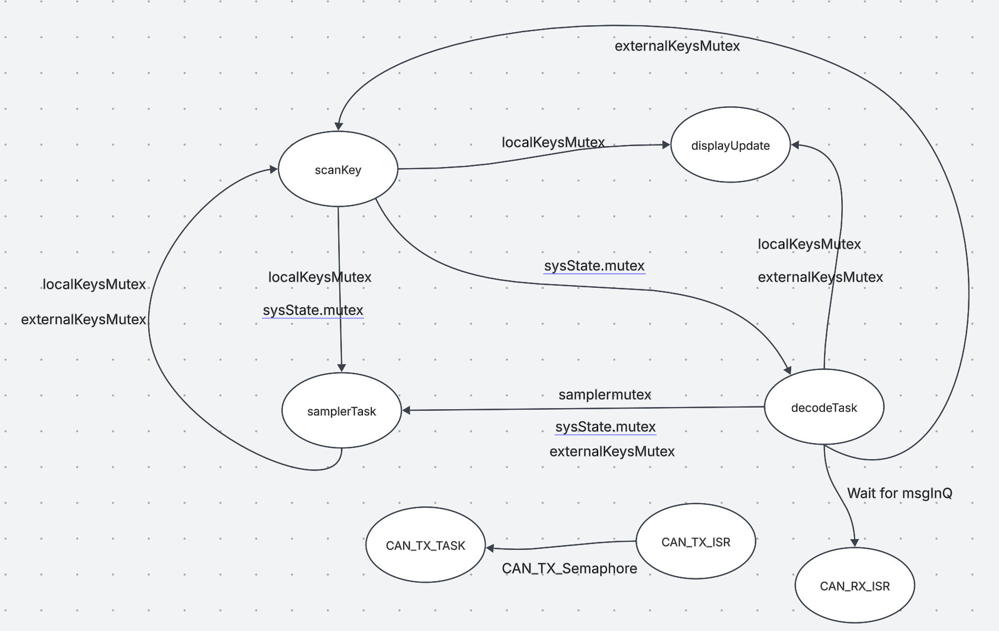

<!-- REPORT.md -->

# Music Synthesizer

Our project works as a music sampler in form of 3 octave keyborad, support maximum 5 keytones chord with a knob volume control.

## Table of Contents

- [1. Functionality video](#1-functionality-video)
- [2. Tasks descriptions](#2-task-descriptions)
- [3. ISR descriptions](#3-isr-descriptions)
- [4. Function descriptions](#4-function-descriptions)
- [5. Execution timing analysis](#5-execution-timing-analysis)
- [6. Shared data structure and safely access strategy](#6-shared-data-structure-with-safely-access-strategy)
- [7. Analysis of deadlock](#7-analysis-of-deadlock)

## 1. Functionalites and video demonstrations

1. **Music Synthesisor**:
   A keyboard spanning Octave 4 to Octave 6.
2. **Automatic octave detection**:
   Synth modules use handshaking to automatically set up their roles and octaves
3. **Polyphony**:
   Play multiple notes simultaneously
   [veiw on microsfot stream](https://imperiallondon-my.sharepoint.com/:v:/r/personal/dy622_ic_ac_uk/Documents/poly%201.mp4?csf=1&web=1&e=dUEdel&nav=eyJyZWZlcnJhbEluZm8iOnsicmVmZXJyYWxBcHAiOiJTdHJlYW1XZWJBcHAiLCJyZWZlcnJhbFZpZXciOiJTaGFyZURpYWxvZy1MaW5rIiwicmVmZXJyYWxBcHBQbGF0Zm9ybSI6IldlYiIsInJlZmVycmFsTW9kZSI6InZpZXcifX0%3D) or [Download the video](poly.mp4)
4. **Volume control**:
   Adjust volume using knob3
   [veiw on microsfot stream](https://imperiallondon-my.sharepoint.com/:v:/r/personal/dy622_ic_ac_uk/Documents/volume%202.mp4?csf=1&web=1&e=6xkEwX&nav=eyJyZWZlcnJhbEluZm8iOnsicmVmZXJyYWxBcHAiOiJTdHJlYW1XZWJBcHAiLCJyZWZlcnJhbFZpZXciOiJTaGFyZURpYWxvZy1MaW5rIiwicmVmZXJyYWxBcHBQbGF0Zm9ybSI6IldlYiIsInJlZmVycmFsTW9kZSI6InZpZXcifX0%3D)or [Download the video](volume.mp4)
5. **Music sampler**:
   Click Knob2 to enter Sampler Mode. In this mode, the Synth Module loops a bar while recording the keys you play. The recorded keys will be replayed in the next loop.The sampler also support polyphony. Click Knob2 again to exit Sampler Mode.
   [view on microsfot stream](https://imperiallondon-my.sharepoint.com/:v:/r/personal/dy622_ic_ac_uk/Documents/sampler%203.mp4?csf=1&web=1&e=8Bkbky&nav=eyJyZWZlcnJhbEluZm8iOnsicmVmZXJyYWxBcHAiOiJTdHJlYW1XZWJBcHAiLCJyZWZlcnJhbFZpZXciOiJTaGFyZURpYWxvZy1MaW5rIiwicmVmZXJyYWxBcHBQbGF0Zm9ybSI6IldlYiIsInJlZmVycmFsTW9kZSI6InZpZXcifX0%3D)or[Download the video](sampler.mp4)

## 2. Task descriptions

Each task's implementation, purpose, and real-time considerations are documented in [task.md](task.md). It's also able to click each listed task downward to the corresponding part.

- [**scanKeysTask**](task.md#1-scanKeysTask)
- [**displayUpdateTask**](task.md#2-displayupdatetask)
- [**CAN_TX_Task**](task.md#3-can_tx_task)
- [**decodeTask**](task.md#4-decodetask)
- [**samplerTask**](task.md#5-samplertask)
- [**metronomeTask**](task.md#6-metronometask)

## 3. ISR descriptions

The system also contains ISR-based functions that handle real-time audio and CAN communication.

For ISR details, refer to [isr.md](isr.md).

- [**sampleISR**](isr.md#1-sampleisr)
- [**CAN_RX_ISR**](isr.md#2-can_rx_isr)
- [**CAN_TX_ISR**](isr.md#3-can_tx_isr)

## 4. Function descriptions

This section documents key system functions related to note handling, handshaking, event simulation, and sampling.

For detailed descriptions, refer to [function.md](function.md).

- [**setStepSizes()**](function.md#1-setstepsizes)
- [**autoDetectHandshake()**](function.md#2-autodetecthandshake)
- [**readHandshake(bool &west, bool &east)**](function.md#3-readhandshakebool-west-bool-east)
- [**simulateKeyEvent()**](function.md#4-simulatekeyeventconst-noteevent-event)
- [**sampler_recordEvent(char type, uint8_t octave, uint8_t noteIndex)**](function.md#5-sampler_recordeventchar-type-uint8_t-octave-uint8_t-noteindex)
- [**releaseAllNotes()**](function.md#6-releaseallnotes)

## 5. Execution timing analysis

1. **Worst case execution time summery**
   | Task name | CPU usage (isolated) |Worst case execution time | Testing method |
   |----------------|-----------------------|------------------|------------------|
   | scanKeysTask | 93% | 110 µs | [scanKeysFunction](wcet.md#scankeysfunction)|
   | displayUpdateTask | 19% | 99840 µs | [displayUpdateFunction](wcet.md#displayupdatefunction)|
   | decodeTask | 10% | 50660 µs | [decodeFunction](wcet.md#decodefunction)|
   | CN_TX_Task | 1% | 6870 µs | [CN_TX_Function](wcet.md#can_tx_function)|
   | samplerTask | 5% | 1134890 µs | [samplerFunction](wcet.md#samplerfunction)|
   | metronemoTask | 1% | 199250 µs | [metronemoFunction](wcet.md#metronomefunction)|
   | sample_ISR | | 15 µs | [sampleISRTest](wcet.md#sampleisrtest)|

**Testing Methodology**

**1. Mode Switching**
-Testing is controlled via `#ifdef TestMode`, allowing individual task isolation.  
-Ensuring to `#define STATSTASK` when switching to the TestMode to start `vTaskGetRunTimeStats()` thread.

Example:

```cpp
#define TestMode   // Runs TestMode setup()
#define STATSTASK  // Runs vTaskGetRunTimeStats()
#define SCAN_KEYS  // Runs scanKeysFunction
```

**2. Measuring WCET for Tasks**

- `statsTask` logs execution time every **5s** using `vTaskGetRunTimeStats()`.
- IterationCounter is inserted in each Function to obtain execution time per iteration.
- CPU usage per task is also extracted from `vTaskGetRunTimeStats()`.

**3. Measuring WCET for ISR**

- Records `micros()` at ISR entry/exit.
- `maxIsrTime` stores the worst-case execution time.
- Logs every **1000 executions**.

## 6. Shared data structure with safely access strategy

Our design use Mutex, atomic instruction and thread safe queue to ensure safe data access and synchonrisation.

### Atomic intruction

Atomic instructions ensure each store operation is uninterruptible, so the ISR always sees a fully updated value rather than a partial write. In this code,
calls like

```c++
 `__atomic_store_n(&currentStepSize1, localStepSize1, __ATOMIC_RELAXED)` //five copies of these for polyphony)
  `__atomic_store_n(&sysState.volume, localVolume, __ATOMIC_RELAXED)`
```

are applied to update `currentStepSize1` and `sysState.volume` which used for generating wave in `sampleISR`. Therefore, `sampleISR` will either read the old value or the fully updated value but never a partial update.

### Message enqueue

Following the lab instruction, any thread can call `xQueueSend(msgOutQ, TX_Message, portMAX_DELAY)` and send the message by placing it in a queue `msgOutQ`. The transmiiting thread use a semaphore to check when it can place a message to the queue. `CAN_TX_TASK` task pulls the mesasge from queue and send it. This ensures the enqueue operation to be atomically and no race conditions would corrupt the queue.

### Mutex Overview

The following table outlines the mutexes used in the system, the data they protect, and a brief description of their purpose. Having these mutexes ensures thread-safe access and prevents data corruption or race conditions. More information about mutex usage can be found in (#4-function-descriptions) and (#2-task-descriptions).

| Mutex Name              | Data it Protects                                                  | Description                                                                                                 |
| ----------------------- | ----------------------------------------------------------------- | ----------------------------------------------------------------------------------------------------------- |
| **`localKeysMutex`**    | `std::bitset<12> keys4`                                           | Key states for octave 4 (local keyboard).                                                                   |
| **`externalKeysMutex`** | `std::bitset<12> keys5`<br>`std::bitset<12> keys6`                | Key states for octave 5 and 6 (external keyboards).                                                         |
| **`sysState.mutex`**    | `std::bitset<32> sysState.inputs`<br>`Knob knob2`<br>`int volume` | System state including:<br>- Local input states<br>- Knob 2 pressstate (toggles sampler)<br>- Volume level. |
| **`samplerMutex`**      | `recordingBuffer[MAX_EVENTS]`                                     | Buffer holding recorded note playback events.                                                               |

## 7. Analysis of Deadlock

The dependency for our design are shown below. Each arrow is labeld with the blocking operation that create this dependency. For example, task **`displayUpdate`** depends on task **`scanKey`** by waiting on **`localKeysMutex`** which protects `std::bitset<12> keys4` tracking octave 4 key states. Although the resulting graph is not strictly a Directed Acyclic Graph (DAG),there are loops among tasks like **`scanKey`** and **`samplerTask`**, it does not lead to a deadlock. These mutex doesn't constains another mutex or any blocking statements, and the mutex are unconnditonally unlocked, there is no circular wait condition.


Moreover, our design has refined to maximally avoid the possibility of deadlock by considering the following points.

1. **ISR can't be locked by mutex:**  
   A thread can be blocked if it does not own a mutex, but ISR can't be blocked. So if an ISR is triggered and has no mutex, the program will be deadlocked in ISR.

2. **Avoid nested lock**  
   Nested locking occurs when a task acquires a mutex while already holding another mutex. If two tasks acquire multiple mutexes in different orders, there is a potential risk of deadlock due to circular waiting. Our code is designed to avoid nested locking, each mutex is released before another mutex is acquired, thus eliminating the possibility of deadlock due to inconsistent lock ordering.

3. **Priority Inversion:**  
   This happens when a mutex is owned by a low-priority task, and a high-priority task is waiting for it. However, a middle-priority task that does not rely on that mutex occupies the CPU. In this case, the high-priority task will be blocked.

   FreeRTOS has built in mechanisms to solve priority inversion using priority inheritance. If a high-priority task attempts to acquire a mutex held by a lower-priority task, FreeRTOS temporarily boosts the priority of the lower-priority task to match that of the highest-priority task waiting for that mutex.
